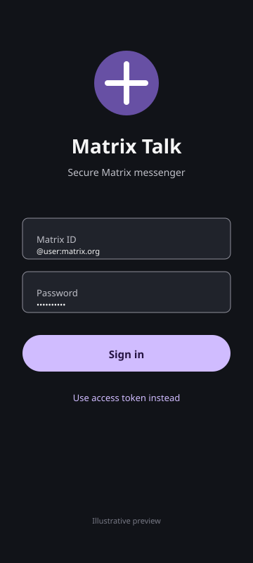
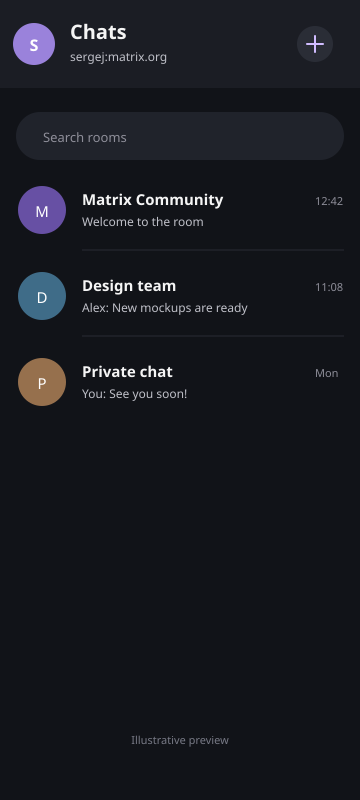
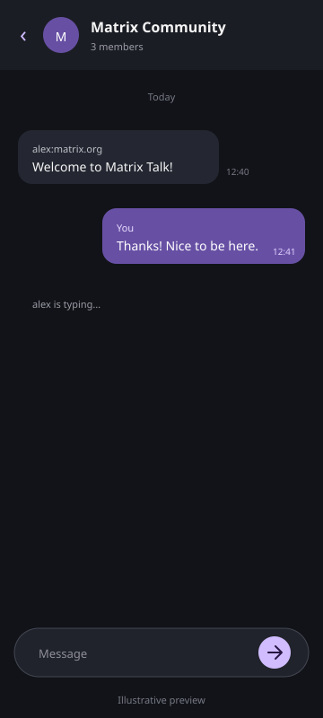

# MatrixTalk

Мультиплатформенный клиент для децентрализованной сети **Matrix**, написанный на **Kotlin Multiplatform** с общим UI на **Compose Multiplatform**. Один код — три платформы.

| Платформа | Статус |
|-----------|--------|
| 🤖 Android | ✅ Готово (APK в [релизах](https://github.com/sergej19882906/matrixtalk/releases)) |
| 🖥️ Windows / Linux / macOS | ✅ Готово (MSI / DEB / DMG в [релизах](https://github.com/sergej19882906/matrixtalk/releases)) |
| 🍎 iOS | 🚧 В планах |

## Возможности

### 💬 Мессенджер
- ✅ Вход по логину/паролю и по Matrix access token
- ✅ Список чатов/комнат с непрочитанными и последним сообщением
- ✅ Отправка текстовых сообщений, изображений, видео, аудио и файлов
- ✅ Просмотр вложений в чате: изображения инлайн, файлы по клику (включая E2E-шифрованные)
- ✅ Загрузка истории переписки («Загрузить ранее»)
- ✅ Индикатор набора текста (typing)
- ✅ Реакции с отображением счётчиков, редактирование и удаление сообщений
- ✅ Прямые чаты (DM) и групповые комнаты: создание, вход по alias, выход
- ✅ Профиль: display name и аватар
- ✅ Персистентная сессия — автовход при перезапуске
- ✅ Персистентный кэш (Realm): быстрый запуск без полной синхронизации
- ✅ E2E-шифрование (через libolm), в т.ч. просмотр зашифрованных вложений
- ✅ Уведомления о новых сообщениях на Android (фоновая синхронизация)
- ✅ Material Design 3 и тёмная тема, корректная работа с вырезами экрана и наэкранными кнопками

### 📞 Аудио-видео звонки (VoIP)
- 🚧 Экраны звонков и сигналинг — в разработке
- 🚧 WebRTC-медиа — в планах (Android → Desktop → iOS)
- ✅ Серверная часть: Coturn (TURN/STUN) включён в Docker-стек

### 🔗 Мосты Telegram, WhatsApp и Signal
- ✅ Экран настройки мостов в приложении
- ✅ Серверная заготовка: Synapse + PostgreSQL + Coturn + mautrix-мосты
- ✅ Полная инструкция по установке сервера в [`docs/bridges.md`](docs/bridges.md)

## Сервер

`docker-compose.bridges.yml` — готовый стек для собственного Matrix-сервера.
Кастомные Docker-образы с авто-конфигурацией из env-переменных публикуются в [ghcr.io](https://github.com/sergej19882906/matrixtalk/pkgs/container/).

| Сервис | Образ | Назначение |
|--------|-------|------------|
| **Synapse** | `ghcr.io/sergej19882906/matrixtalk-synapse` | Matrix homeserver |
| **synapse-admin** | `awesometechnologies/synapse-admin` | Веб-интерфейс администрирования (порт 8080) |
| **PostgreSQL** | `postgres:16-alpine` | База данных |
| **Coturn** | `coturn/coturn:latest` | TURN/STUN сервер для VoIP-звонков |
| **mautrix-telegram** | `ghcr.io/sergej19882906/matrixtalk-mautrix-telegram` | Мост Telegram |
| **mautrix-whatsapp** | `ghcr.io/sergej19882906/matrixtalk-mautrix-whatsapp` | Мост WhatsApp |
| **mautrix-signal** | `ghcr.io/sergej19882906/matrixtalk-mautrix-signal` | Мост Signal |

Пошаговая инструкция по установке и настройке — в [`docs/bridges.md`](docs/bridges.md).

## Скриншоты интерфейса

<p>
  
  
  
</p>

## Технологии

| Компонент | Технология |
|-----------|-----------|
| **Язык** | Kotlin Multiplatform (2.0.21) |
| **UI** | Compose Multiplatform + Material 3 |
| **Архитектура** | MVVM + Clean Architecture, общий модуль `shared` |
| **DI** | Koin 4 |
| **Matrix SDK** | [Trixnity](https://github.com/connect2x-de/trixnity) 4.11 |
| **E2E-шифрование** | libolm (trixnity-olm) |
| **Сеть** | Ktor client 3 |
| **Изображения** | Coil 3 (KMP) |
| **Сессия/кэш** | DataStore Preferences, Realm (trixnity-client-repository-realm) |
| **Сборка** | Gradle KMP: Android + Desktop(JVM); iOS в планах |

## Структура проекта

<pre>
├── shared/                     # Общий KMP-модуль
│   └── src/
│       ├── commonMain/         # Всё общее: модели, репозитории, ViewModel'и, UI, DI
│       ├── androidMain/        # Android-actuals (контекст, файлы, пути)
│       └── desktopMain/        # Desktop-actuals (JVM)
├── app/                        # Android-приложение (Activities, сервисы, ресурсы)
├── desktop-app/                # Desktop-приложение (Compose Window, точка входа JVM)
├── docker/                     # Кастомные образы Synapse + mautrix-мостов
├── docs/                       # Инструкция по серверу, скриншоты
└── server-data/                # Данные сервера (gitignored)
</pre>

## Сборка и запуск

### Требования
- JDK 17
- Android Studio Ladybug (2024.2.1) или новее — для Android
- Android SDK 36 — для Android

### Android
Откройте проект в Android Studio и запустите на эмуляторе/устройстве, либо:

```bash
# Windows
.\gradlew.bat :app:assembleDebug

# Linux/macOS
chmod +x gradlew
./gradlew :app:assembleDebug
```

### Desktop (Windows / Linux / macOS)

```bash
./gradlew :desktop-app:run          # запуск из исходников

# инсталляторы:
./gradlew :desktop-app:packageMsi   # Windows (.msi)
./gradlew :desktop-app:packageDeb   # Linux (.deb)
./gradlew :desktop-app:packageDmg   # macOS (.dmg)
```

Для подписанного release APK поместите keystore в корень проекта и укажите параметры в `local.properties` (см. раздел CI/CD ниже — в релизах APK уже подписан).

## CI/CD

GitHub Actions:

- **CI** (push/PR в `main`) — сборка Android APK + компиляция Desktop, валидация docker-compose.
- **Release** (тег `v*`) — подписанный Android APK + инсталляторы MSI/DEB/DMG, публикация [GitHub Release](https://github.com/sergej19882906/matrixtalk/releases) с заметками из `RELEASE_NOTES.md`.
- **Docker** (push в `main`, теги) — сборка и пуш образов сервера в ghcr.io (`linux/amd64` + `linux/arm64`).

Подпись release APK в CI настраивается секретами репозитория: `KEYSTORE_BASE64`, `KEYSTORE_ALIAS`, `KEYSTORE_PASSWORD`, `KEY_PASSWORD`.

Чтобы выпустить версию: обновите `versionName`/`packageVersion`, добавьте секцию в `RELEASE_NOTES.md`, затем:

```bash
git tag v1.5.0 && git push origin v1.5.0
```

## История версий

См. [`RELEASE_NOTES.md`](RELEASE_NOTES.md).

## Лицензия

См. [`LICENSE`](LICENSE).
